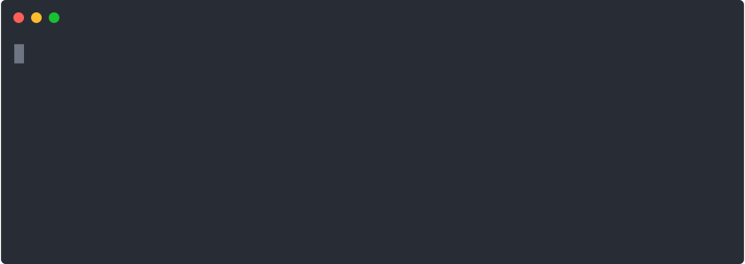

# Nevskii DB

A PostgreSQL database for the Nevskii platform. Create locally using Docker and deploy to Heroku.

<p align="center">
  
</p>

## Local setup

Clone and install dependencies.

At the project root, create a `.env` file with relevant credentials.

```bash
PG_PASS=abcd
PGPASSWORD=abcd
PG_USER=postgres
PG_DB_NAME=nevskii
PG_HOST=localhost
PG_PORT=5432
```

To run the database, use Docker's official [PostgreSQL image](https://hub.docker.com/_/postgres) and [run](https://docs.docker.com/engine/reference/commandline/run/) in a new container.

```bash
# Get the Docker image
# docker pull {official_image_name}
docker pull postgres

# Create a new container ...
# docker run --name {container_name} -env POSTGRES_PASSWORD={pg_pass} -d -p {host_port}:{container_port} {pg_username}
# -env  set environment variable(s)
# -d    run as daemon
# -p    expose port
docker run --name pgDocker -env POSTGRES_PASSWORD=abcd -d -p 5432:5432 postgres

# ... or start if already created!
# docker start {container_name} # if the container already exists
docker start pgDocker
```

## Heroku free tier

For deployment to Heroku's PostgreSQL [free tier](https://elements.heroku.com/addons/heroku-postgresql) please take into account the 10,000 total SQL rows limit (as of Oct. 2020). **Processing all items from source files will exceed that limit!** Use the indicative table below to find a sweet spot and set the [source file](https://github.com/niiccolas/nevskii-db/blob/b17d3dac9f8e8c2cd05934516766a0428953b4b3/src/index.js#L44) and [range](https://github.com/niiccolas/nevskii-db/blob/b17d3dac9f8e8c2cd05934516766a0428953b4b3/src/index.js#L43) build options accordingly.

| source file                           | items | range               | total SQL rows |
| ------------------------------------- | ----- | ------------------- | -------------- |
| `dvd_8182.csv`                        | 8182  | 0-8182              | 164477         |
|                                       |       | **0-200**           | **5486**       |
| `dvd_8182_mint.csv` (no missing data) | 4412  | 0-4412              | 100785         |
|                                       |       | **0-400** (default) | **8860**       |

Once your database is deployed, you can also use the following Heroku plugin to track your row count:

```bash
heroku plugins:install heroku-pg-extras
heroku pg:index_usage --app {heroku_app_name}
```

## Deployment

Run the following commands in seuquence. For more details, see Heroku [docs](https://devcenter.heroku.com/articles/heroku-postgres-import-export#import-to-heroku-postgres).

```bash
# Rerun the local DB creation script
npm run make-db

# Dump local DB
docker exec pgDocker pg_dump -Fc --no-acl --no-owner -h localhost -U postgres nevskii > nevskii.dump

# Upload DB dump to an HTTP-accessible URL (e.g.: AWS S3 bucket)...
aws s3 cp nevskii.dump s3://{bucket_name}

# Generate a signed URL
aws s3 presign s3://{bucket_name}/nevskii.dump

# Create DB on Heroku
heroku addons:create heroku-postgresql:hobby-dev

# Populate Heroku DB from dump
heroku pg:backups:restore '<SIGNED URL>' DATABASE_URL
```
